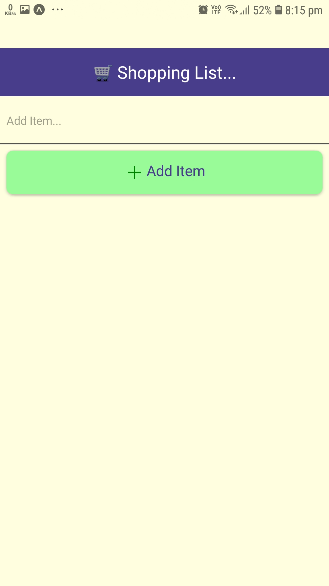
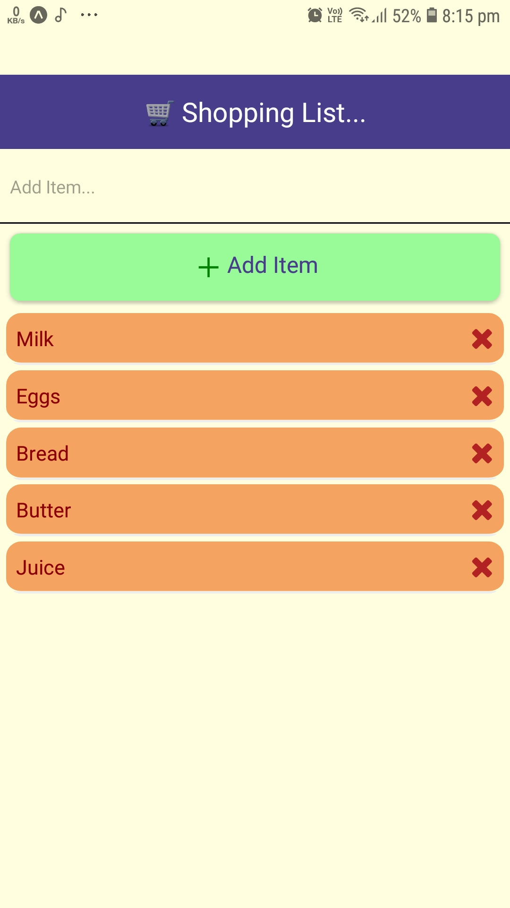

# 🛒 Shopping List

## Get Started


```bash
# install expo cli
npm install -g expo-cli
```

```bash
# install dependencies
npm install
```

Or use `yarn`

```bash
yarn install
```

Run project

```bash
# run project
npm start
```

## 📃 Features

- A simple shopping list app
- Add items to the list
- Delete items form the list
- Clear the input field on submit
- check for input value

## Demo

<div style="display: flex; justify-content: space-around; flex-wrap: wrap">
 
 
</div>

## ⚒️ Upgrade project

```bash
# upgrade project
expo-cli upgrade
```

## ⭐ Contributing

If you'd like to contribute, please fork the repository and make changes as
you'd like. Pull requests are warmly welcome.
